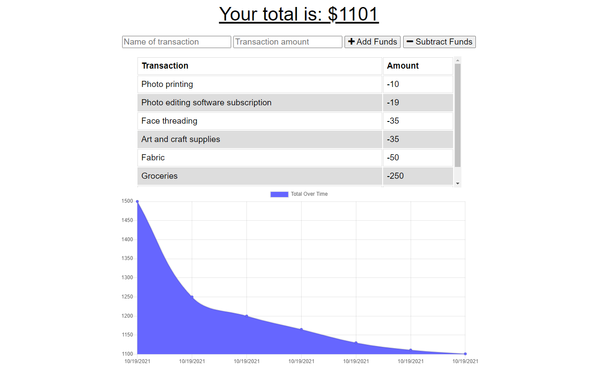

# Budget Tracker

[](https://opensource.org/licenses/MIT)

## Description

This project is a **Progressive Web Application (PWA)** used to track your income and expences. It works **both offline and online**. It can be used to add your various income sources and the way that you would expend them. The application presents the remaining balance, and a graph is presented with the income and expenditure of the user.

This application is built using several technologies and tools. As frontend languages **HTML, CSS and Javascript** are used. Apart from that **MongoDB, Node.js, Mongoosejs as Object Document Mapping (ODM) and Express server.** Furthermore, when the application is offline, it uses **IndexDB** in order to save the transactions happened and once the the application is online and connected, it saves all the transactions to the MongoDB. This application is deployed using **MongoDB Atlas and Heroku.**

## Table of Contents

- [Important Links](#Important-Links)
- [Mockup](#Mockup)
- [Installation](#Installation)
- [Usage](#Usage)
- [License](#License)
- [Contribute](#Contributing)
- [Questions](#Questions)

## Important Links

Following are the important links related to this application.

- [Budget Tracker - Heroku Deployment](https://glacial-basin-20895.herokuapp.com/)
- [Budget Tracker - Github Repo](https://github.com/vish-opatha/budget-tracker)

## Mockup

_Main Page_



## Installation

To install the necessary dependencies, run the following command:

```
npm install
```

## Usage

You can run the project by cloning this project to your local machine. You need to have MongoDB Community Server installed in your local computer (Please visit [https://www.mongodb.com/try/download/community](https://www.mongodb.com/try/download/community) for more details). To run the project locally, run the following command.

```
node server.js
```

After the above step go to the browser and access the application using localhost:3000. If you prefer to use the live or deployed version of the application, please go to the deployed link given in the 'Important Links' section.

## License

This project is licensed under the MIT license.

## Contributing

Any user can contribute this project by raising an issue in the github repository.

## Questions

If you have any questions about the repo, open an issue or directly contact me at <v.opatha@gmail.com> You can find my other work at [Github](https://github.com/vish-op)
